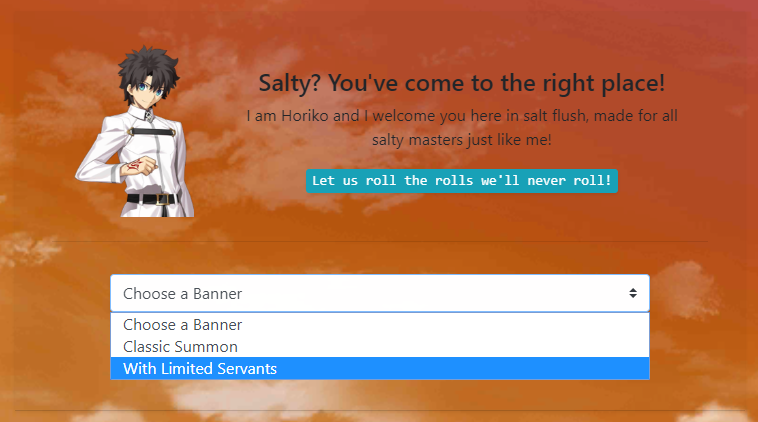
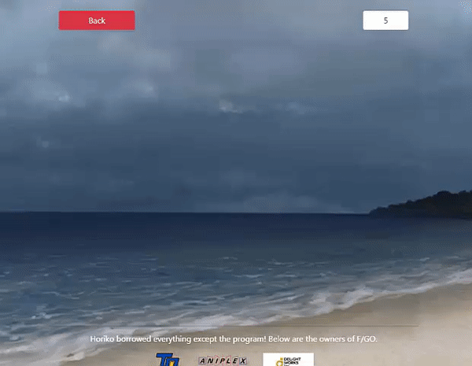
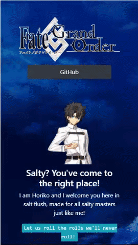

# fgoSaltFlush

**F/GO not giving you your waifu or husbando?** Try fgoSaltFlush and flush your salt away, though not guaranteed. ~~Your salt level could be too high just like mine that no amount of fake rolls could quench it.~~ Anyway, you can use salt flush for warm up rolls, good luck charm, or if you're itching to roll but you're saving for a servant you'll never get if you're f2p.

fgoSaltFlush aims to mimic the summoning system of Chaldea by adding animations in the summon process, making it look and feel a little bit the same as the original. Its goal is to make me happy because I'm so done with my rolls.

Please note that fgoSaltFlush is currently on its **alpha stage**. Also, this follows after **F/GO NA**.

## Disclaimer
I do not own Fate/Grand Order, commonly known as F/GO, or any of the assets (images or sound) used here in salt flush. F/GO belongs to [Type-Moon](http://typemoon.com/), [Aniplex](http://aniplexusa.com/), and [Delight Works Inc.](https://www.delightworks.co.jp/) I just own the program, the codes.  
  
For the animations, everything was easy thanks to [Animate.css](https://daneden.github.io/animate.css/) then I got the assets [here](https://www.reddit.com/r/grandorder/comments/7di9d0/so_newer_fgo_assetsbgcgui_were_ripped_from_the/) and from [F/GO Cirnopedia](https://fate-go.cirnopedia.org/).

## Specifications
**Language/s:** HTML, CSS, JavaScript, jQuery   
**Platform:** Website   
**Framework/s:** Bootstrap 4   

*__**fgoSaltFlush__ is better to use with Google Chrome since some animations may not work with other browsers*

## Summoning System
    
   
Since fgosSaltFlush is still on alpha stage, and *I did this for fun*, I only used basic math ~~(no probabilities or whatsoever)~~ and did it the way I imagined the summoning would be. That means **summoning is not accurate**, **not close to how F/GO does its summoning**, and **can't be used for studying probability of rolls** for now. I will improve the summoning some time later so I can use it for predicting my rolls. For now I'll just explain what I did with this flush thing.

### Rarity
   | Rarity | Servant | Craft Essence |
   |--------|---------|---------------|
   | 5 Star | 1%      | 4%            |
   | 4 Star | 3%      | 12%           |
   | 1 Star | 40%     | 40%           |

Of course, I used the rates of summoning that F/GO provided. From what I understood, you have a **44% chance of summoning a servant** and **56% chance for craft essence**. I didn't include the **drop rates of each servant** in the calculation because ~~I'm not really sure (???) how and where to include those rates in the program I made. I'll just figure that out later.~~

### Process
Now, here's how fgoSaltFlush plans to flush your salt.
1. First thing I did when I got the banner is **split the pool** into two types, **servant** and **craft essence**.
2. We all know that if you roll for 10x, you'll have a guaranteed 4* above card. Before finding out what's the card type and rarity, **determine first the position of the guaranteed card** if rolling for 10x. This is where the system starts to rely on **RNG** or **random number generation**. 0-9 will be the range, the result will be the place of the guaranteed card.

3. ~~**RNG again for finding out the card's type and rarity**. I decided to **get the type first**, so the range is from 1-100. If the number generated is from **1-44** (44%), the card is a servant otherwise **45-100** (56%) its a craft essence. Do **another RNG for rarity** and see the table below to find out the equivalent rarity of numbers.~~

3. Instead of doing the RNG for type and rarity separately, I did it in one go. I also used float, then **decrement at each if condition until it reaches below zero**. On which condition it falls determine's the type and rarity. Below is the corresponding rarity per condition, the amount it decrements, then falls under it **if result is < 0**. 

   | Rarity | Servant   | Craft Essence |
   |--------|-----------|---------------|
   | 5 Star | 1 : -0.01 | 4 : -0.04     |
   | 4 Star | 2 : -0.03 | 5 : -0.12     |
   | 3 Star | 3 : -0.40 | 6 : -0.40     |
   
   #### Special thanks to that person in reddit who helped me!
    
4. The **entire process of step three is in a loop** by the way, which calls `rollCard(guaranty)` for the number of rolls you chose. When the counter reaches the position of the guranteed card, the variable `guaranty`,  a boolean, is set to true. ~~When picking the rarity, this boolean is used to **shorten the range of the pool to 1-4 for servants and 1-16 for ce**.~~ Then conditions 3 and 6 from tables above will be excluded, making CE SR's rate 92%.

5. **Next step is to pick the specific card, the spirit orgin**. The **rarity** (actual number from RNG) and **pool** (servant/ce) is passed to a function `rollSpiritOrigin(rarity, pool)` which when number of stars is determined (5*/4*/3*), the pool splits and is grouped by rarity. From there, **do another RNG using the range of the split pool to pick the card**.

If you know something that I dont, or if there's something wrong with what I did, please feel free to tell me by giving an issue! You can also send me recommendations to make fgoSaltFlush more exciting or your thoughts about this nonsense stuff.

## Features
### Banner
     
   
You can choose a banner to roll from. For now I only made two banners, **Classic** and **With Limited Servants**.
1. **Classic** - Equivalent of Story Summon
2. **With Limited Servants** - pretty self-explanatory, though I also included the welfare servants in the pool

### Yolo or 10x
Like the summoning system in Chaldea, you can choose how many times you would like to summon and cry.

### Animations
    
   
*fgoSaltFlush doesn't just show you what your RNG luck dictates in a form of list or table*. 

It animates the summoning, just like the original summoning system in F/GO. I tried my best to make it feel more similar by using flip and fade animations, showing the class card first then the card itself.

### Random Background 
I inserted a miscellaneous function that gives random backgrounds upon load. There are 8 backgrounds in the bgpool.

### Responsive
   
  
System adapts base on the size of screen. Used bootstrap for this and bunch of ~~nasty css tricks~~.

## Issues
You might encounter some bugs because I haven't slept yet. Here are the ones I noticed, but shouldn't affect your flushing that much. I'm stil a noob to responsive web design so please bear with me and my salt.

1. **Result Summary**. I had a little problem with displaying the result thumbnails of the summon. The one I did with the card didn't work with the thumbnails, so I tried another way but the responsive function was affected. The thumbnails doesn't adapt to all screen sizes unlike the cards. **Expect frames and thumbnails to not fit on certain device screen sizes.**

2. **Black Glitch**. The screen flashes black, must be due to the black background color of `body`, when page changes.  

3. ~~**Summon Accuracy**. I have already mentiod this above but I'll say it once more. The **calculation for summoning is not accurate** and **is a bit of loose right now since I noticed that its easy to get an SSR**, ~~which is good for your salt anyway~~. I dont mean easy as in you'll get SSRs in a row or every roll you make, just more frequent than the original salty summon?? But it still makes sense, at least for me.~~  **Not 100% accurate but it's better than before**. There's still a problem though... You can do a 10 roll without servant. Will add checking in the future.

4. **Blank Images**. Because I am too sleepy, I incorrectly typed some of the names of the servants and craft essences. The `url` of background-images of `div` or `src` attributes of `img` rely on names so nothing will appear if the name doesn't match any of the filenames. **If you ever encounter this, please let me know by submitting an issue about it**.

5. **Lag in loading images**. May experience a lag in loading of images, especially when connection is slow. You'll have no lag problem if fgoSaltFlush is locally stored in your device.

6. **System will go crazy if you leave the window while summon is on going**. Animations rely on `setTimeout` and `setInterval`. A card won't flip if you're currently not on the page, so the system will go crazy because the time's done but the card isn't done flipping.
  
## Upcoming Features
So far these are my plans for fgoSaltFlush. I don't know when I'll be able to do all of these maybe when I'm so passionate like I am right now. **I was able to complete this because of too much salt btw**, I've had enough and I needed an outlet.

1. ~~Include servants' specific **drop rates** in calculation to improve summoning system and make it more accurate.~~  
2. **Allow f2p's to customize banner**.
    - Select up to 5 servants that will have **increase in drop rates**.
    - **Exclude** cards from pool.
    - **Exclude craft essence** from pool or this could be a **Servant Only Banner**
3. **More banners to choose from.** ex. *per class, paid draw, lucky bag, etc.*
4. Will try to mimic Chaldea's summoning system as much as possible, so **I'll try the rotating circle animation**. If I can't I'll just do something simillar just to hint f2p's what they got. ~~I also want to experience rainbow please~~.
5. **Add sound fx to make summoning less dull.**
6. Make system interactive by making **Romani and Da Vinci speak to you** as you roll. ~~I dunno how will I do this.~~
7. ~~Once summoning is close enough to original, I'll add panels for how much $$$ you'll spend, total rolls, and maybe I'll study probabilty to **equip fgoSaltFlush with some predicting ability**. *I wanna make this nonsense useful somdeday.*~~
9. **Improve loading of images** by lazy loading.
8. Host **data on firebase** and use its real time feature.

## Updates
- Made summon process better than before but **still not 100% accurate**.
- Summon process printed on console. Just right click and inspect or `ctrl+shift+i`.
- ~~Adjust animation for mobile devices.~~ Timing still off.
- If rarity is above R, there's **25%** chance of spark animation.

### May fgoSaltFlush flush your salt, give you peace and spark your rolls
